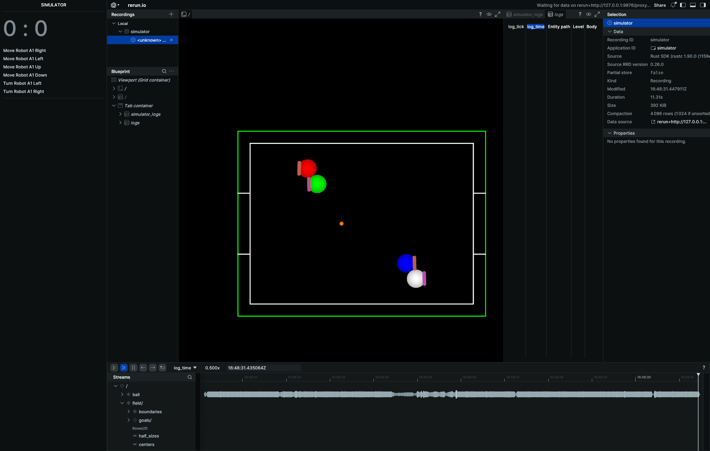

# Simulator

Ce programme permet de simuler des parties proches de celles de la compétition RoboCup Junior Soccer Open.  
Les robots peuvent être programmés en Python par les joueurs.

## Installation

### Windows + Python

- Téléchargez la version la plus récente du programme depuis : https://github.com/LudovaTech/simulator/releases  
- Installez Python 3.13 : https://www.python.org/downloads/release/python-3130/
- [Optionnel] Pour afficher vos propres logs dans l'interface, installez `rerun-sdk` (_pas_ `rerun`) dans cette version de python.

### Linux + Python

Si votre distribution est suffisamment récente (glibc >= 2.40), la build Linux (x86) disponible sur https://github.com/LudovaTech/simulator/releases devrait fonctionner.  
Installez ensuite Python 3.13 et assurez-vous qu'au moment de l'exécution du programme, la variable PATH pointe bien vers cette version de Python (et non vers la version système).  
Si la build ne fonctionne pas, il vous faudra compiler depuis les sources.

### Compiler depuis les sources

La version minimale de Rust prise en charge (d'après cargo msrv) est Rust 1.88.  
Le code a été testé avec la version la plus récente (1.90).  
Préparez-vous à un temps de compilation d'environ 8 minutes sur une machine récente et à environ 10 Gio d'artéfacts de compilation.
